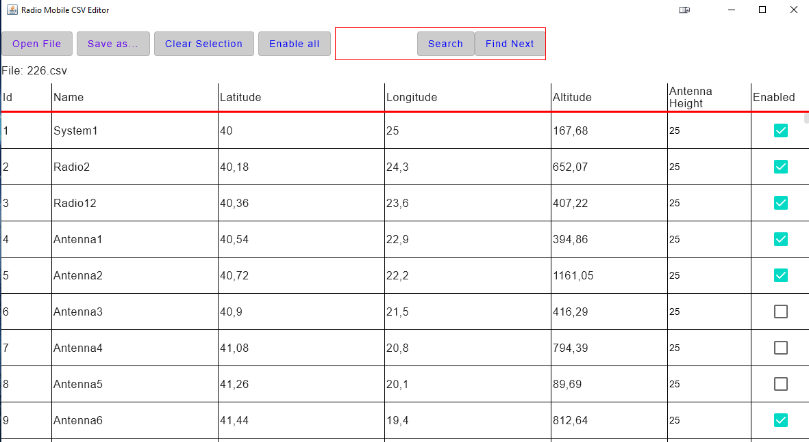
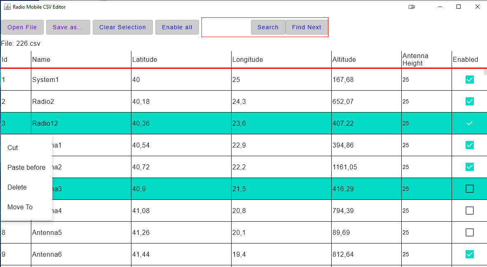

# CSVEd

#### An editor for [Radio Mobile](https://www.ve2dbe.com/english1.html) csv files,

Notice: This editor is somewhat tailored for personal usecases.

  
  

This application is written in Kotlin using Jetpack Compose Desktop and Java Swing for the UI.
For reading and writing to csv files the [Kotlin CSV reader](https://github.com/doyaaaaaken/kotlin-csv) is used.

Use of this app:

- Open files that are exported from RadioMobile (as long as they are saved with the ';' delimiter)
- Save as functionality (can be opened from RadioMobile
- Select one or multiple rows and do the following:
  1) Cut
  2) Paste
  3) Paste from clipboard
  4) Delete (delete key for windows also enabled)
  5) Move to specific line
- Clear Selection
- Enable all systems
- Search for a system by name

For any more info you can reach me at [my LinkedIn](https://www.linkedin.com/in/konstantinos-michelis)
